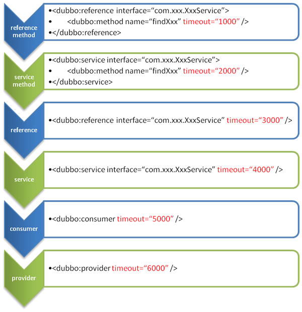

# 配置
| 组件名称            | 描述                             | 范围                                              | 是否必须配置                 |
|-----------------|--------------------------------|-------------------------------------------------|------------------------|
| application     | 指定应用名等应用级别相关信息                 | 一个应用内只允许出现一个                                    | 必选                     |
| service         | 声明普通接口或实现类为 Dubbo 服务           | 一个应用内可以有 0 到多个 service                          | service/reference 至少一种 |
| reference       | 声明普通接口为 Dubbo 服务               | 一个应用内可以有 0 到多个 reference                        | service/reference 至少一种 |
| protocol        | 用于配置提供服务的协议信息，协议由提供方指定，消费方被动接受 | 一个应用可配置多个，一个 protocol 可作用于一组 service&reference  | 可选，默认 dubbo            |
| registry        | 注册中心类型、地址及相关配置                 | 一个应用内可配置多个，一个 registry 可作用于一组 service&reference | 必选                     |
| config-center   | 配置中心类型、地址及相关配置                 | 一个应用内可配置多个，所有服务共享                               | 可选                     |
| metadata-report | 元数据中心类型、地址及相关配置                | 一个应用内可配置多个，所有服务共享                               | 可选                     |
| consumer        | reference 间共享的默认配置             | 一个应用内可配置多个，一个 consumer 可作用于一组 reference         | 可选                     |
| provider        | service 间共享的默认配置               | 一个应用内可配置多个，一个 provider 可作用于一组 service           | 可选                     |
| provider        | service 间共享的默认配置               | 一个应用内可配置多个，一个 provider 可作用于一组 service           | 可选                     |
| monitor         | 监控系统类型及地址                      | 一个应用内只允许配置一个                                    | 可选                     |
| metrics         | 数据采集模块相关配置                     | 一个应用内只允许配置一个                                    | 可选                     |
| ssl             | ssl/tls 安全链接相关的证书等配置           | 一个应用内只允许配置一个                                    | 可选                     |
| method          | 指定方法级的配置                       | service 和 reference 的子配置                        | 可选                     |
| argument        | 某个方法的参数配置                      | method的子配置                                      | 可选                     |

### service 与 reference
service 与 reference 是 Dubbo 最基础的两个配置项，它们用来将某个指定的接口或实现类注册为 Dubbo 服务，并通过配置项控制服务的行为。

service 用于服务提供者端，通过 service 配置的接口和实现类将被定义为标准的 Dubbo 服务，从而实现对外提供 RPC 请求服务。
reference 用于服务消费者端，通过 reference 配置的接口将被定义为标准的 Dubbo 服务，生成的 proxy 可发起对远端的 RPC 请求。
一个应用中可以配置任意多个 service 与 reference。

### consumer 与 provider
当应用内有多个 reference 配置时，consumer 指定了这些 reference 共享的默认值，如共享的超时时间等以简化繁琐的配置，如某个 reference 中单独设置了配置项值则该 reference 中的配置优先级更高。

当应用内有多个 service 配置时，provider 指定了这些 service 共享的默认值，如某个 service 中单独设置了配置项值则该 service 中的配置优先级更高。

consumer 组件还可以对 reference 进行虚拟分组，不通分组下的 reference 可有不同的 consumer 默认值设定；如在 XML 格式配置中，<dubbo:reference /> 标签可通过嵌套在 <dubbo:consumer /> 标签之中实现分组。provider 与 service 之间也可以实现相同的效果。

## 配置优先级
优先级从高到低：
- JVM -D 配置。当你部署或者启动应用时，它可以轻易地重写配置，比如，改变 dubbo 协议端口。
- dubbo.xml 文件中的配置
- dubbo.properties 文件中的配置

方法级优先，接口级次之，全局配置再次之。 如果级别一样，则消费方优先，提供方次之。
